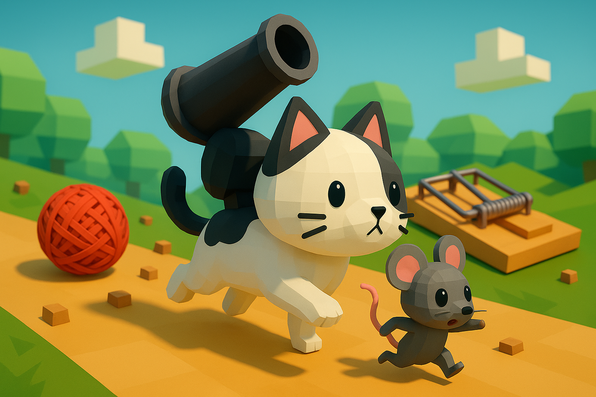
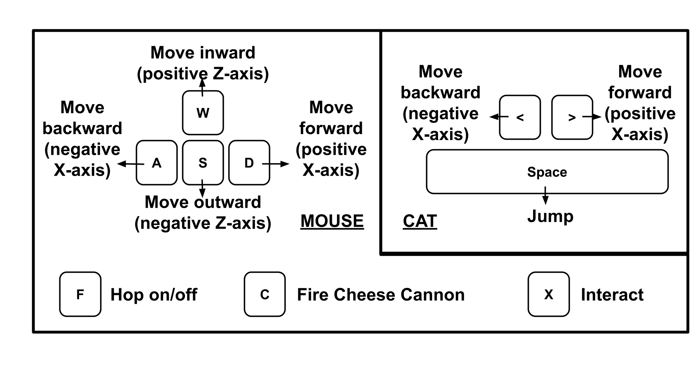

# Cat & Mouse: Woodland Adventure
A Unity3D platformer game, where the main characters, a rat (or mouse) and a cat, must work together to overcome various obstacles and traps using their unique abilities and tools.

Regarding movement in 3D space: the cat can jump but can only move along the X-axis, while the mouse can also move along the Z-axis but is constrained to the ground. This difference in behaviour makes each character useful in different situations. 

The cat is equipped with a cannon on its back, which can destroy certain obstacles. However, the cannon can only be activated by the mouse when it is on the cat’s back. The mouse can also interact with buttons along the way to trigger different mechanisms.

Each character has his own health, and if either one dies, the game ends. Health can be restored by eating special items found along the path.

## Controls

## Development

The game was design and developed in Unity 6 (6000.0.40f1) and built for Apple Silicon.

### Folders and Namespaces organization
We chose to organize our project in many folders containing assets like sound, scripts and textures. The code is organized in two main namespaces:

- `GameUtils`: consists of core components, such as interfaces and abstract classes.

- `MyGame`: includes several namespaces that categorize the scripts by type. They implement all the base classes defined in GameUtils and define some scripts used in our game; some examples are trap scripts and mouse/cat controllers.

### Characters Interaction
The game heavily relies on interaction between the two characters.

In particular: 
- When the mouse is on the cat’s back, it follows the cat’s movement and can activate the cannon. 
- When the mouse is on the ground, it can get on the cat’s back by pressing a specific key. This action is only available when the mouse is within a certain distance from the cat. This is visually indicated by an outline that appears around the cat when it is within reach.

### Cannons and Projectiles
There are two types of cannons in the game: one mounted on the cat’s bac and another that functions as an environmental obstacle.

The cannon on the cat’s back can only be triggered when the mouse is riding it. It launches spinning cheese projectiles that can destroy certain obstacles. These cheese projectiles are destroyed upon collision with any object. 

The obstacle cannon, in contrast, fires yarn balls at fixed time intervals when the cat is within a certain distance. These projectiles can damage both the cat and the mouse. 

### Traps implementation
#### Abstract classes and interfaces
We used some levels of abstraction to handle trap behaviour:
- `TriggerInteraction`: the main abstract class, handles all trigger interaction with mouse/cat in “on enter/stay/exit”. This helped me to create a full trigger-handler system and avoid code repetition.
- `Trap`: it is a subclass of `TriggerInteraction` with some serializedField used in each concrete implementation of a trap. This class adds serialized fields like damageAmount.
  
Some traps don't have complicated behavior and use simple damage scripts:
- `TriggerOnTag`: an abstract class that manages basic trigger interactions with a defined list of tags.
- `TriggerOnTagEnter/Stay/Exit`: derived classes that respond when an object with a matching tag enters, stays in, or exits the trap's trigger area, calling the `Trigger()` method accordingly.
- `DealDamageOntag`: `TriggerOntag` implementation that deals damage on cat/mouse, we also implement a cooldown damage to prevent an “impossible” damage rate.
### Concrete classes
All the next classes are the implementation of all the abstractions we mentioned in the previous section: 

- `MouseTrap`: Deals damage only to the mouse. When the mouse is trapped, it cannot escape. After the cat enters the trigger, it is allowed to exit the trap and gains some health.
- `Barrel`: a minimal object that can be destroyed by projectiles
- `Spike`: The spike does damage only to cats
- `Cloud`: an essential platform that destroys itself if you stay too long on it

### Objects Interaction
We introduced an `Actionable` abstract class that implements an `IAction` interface. This makes it easier to implement interactive objects that are implemented as subclasses of `Actionable`.
For example, the `CustomButton` class itself has a reference to an `Actionable` instance that is triggered when pressed.
Regarding `Actionable`, we have two concrete classes that extend it: `Bridge` and `OakStairs`. In `OakStairs`, we added a check to prevent the player from being pushed away.

### Camera
The `FollowingCamera` script and prefab follows the selected `GameObject`, defined as a `Serializable` field, in the planes defined as serializable parameters (X-Y for the cat, X for the mouse).

`DynamicCameraFollow` is a simple script and prefab that checks the state of the cat and mouse, and if the mouse is on the cat, enables/disables the right cameras. We decided to use this script to handle the split-screen gameplay.

### Graphics and Sound: a few words
We used many assets that were freely available on the Unity Asset Store. 
For example, we used a cat prefab that came with animations and custom movement scripts attached. We removed the original scripts and replaced them with our own, but we reverse-engineered the animations so we could trigger them through our own code.
Other noteworthy graphical features include:
- Animated clouds at the start and end of the game
- Health indicators for both the cat and the mouse
- Idling animals in the background
- Mouse rotation when moving

Regarding the sound and music, we found some useful sounds on the internet.